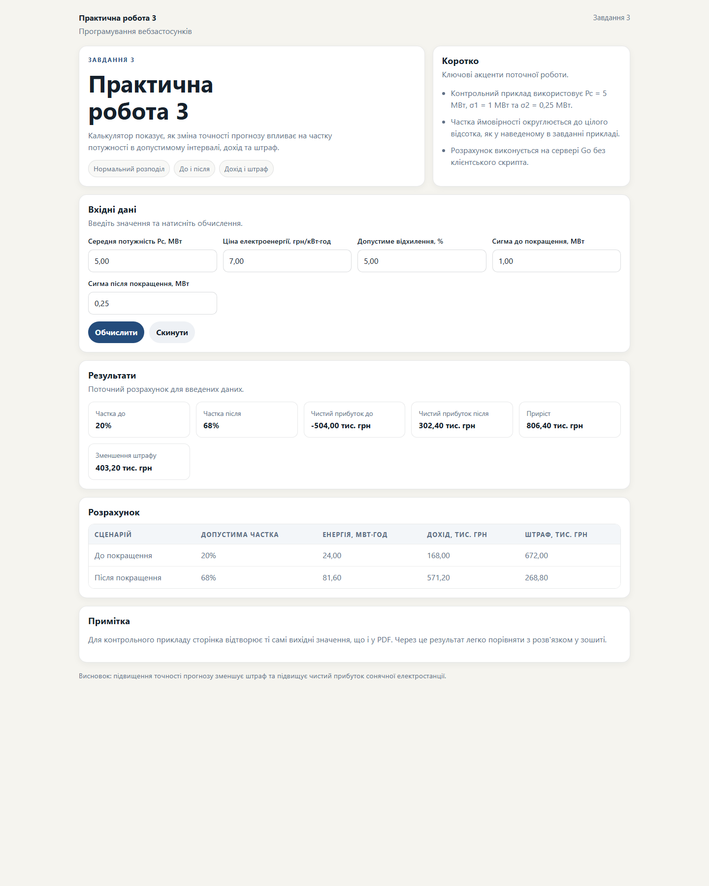

# Практична робота 3

Вебзастосунок з дисципліни **Програмування вебзастосунків** для оцінки прибутку сонячної електростанції до і після покращення точності прогнозування.

## Програмна реалізація

- застосунок написаний мовою Go;
- імовірність у допустимому інтервалі обчислюється за нормальним розподілом;
- серверний рендер виконується через `html/template`;
- результати до і після покращення виводяться в одній таблиці.

## Результат

Сторінка показує допустиму частку потужності, дохід, штраф і чистий прибуток для двох сценаріїв.

## Висновок

Серверний калькулятор на Go зручно демонструє вплив точності прогнозу на економічний результат станції.

